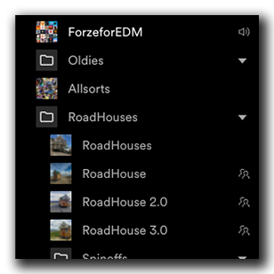
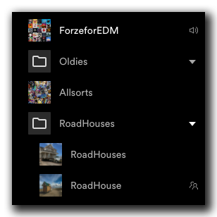
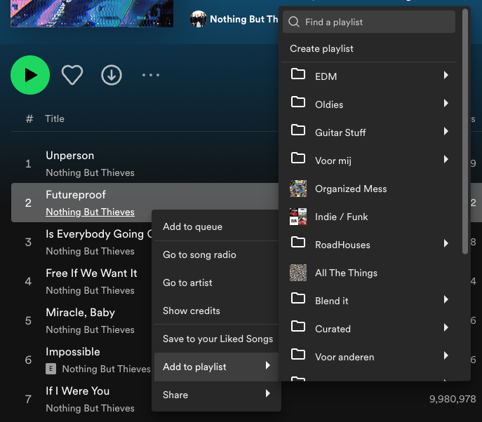

# Playlist icons
Spicetify extension to add the icon of a playlist in front of the playlist the playlist list, and add icons to the 'add to playlist' context menu.  
Small and big icons setting available.  




## Installation
Install via [spicetify-marketplace](https://github.com/CharlieS1103/spicetify-marketplace).

Or the manual way:  
Copy `playlist-icons.js` (from the [dist](https://github.com/jeroentvb/spicetify-playlist-icons/tree/dist) branch) to the spicetify extensions folder
| **Platform**    | **Path**                               |
|-----------------|----------------------------------------|
| **MacOs/Linux** | `~/.config/spicetify/Extensions`       |
| **Windows**     | `%appdata%\spicetify\Extensions\`      |

Run the following commands
```sh
spicetify config extensions playlist-icons.js
spicetify apply
```
